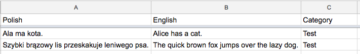
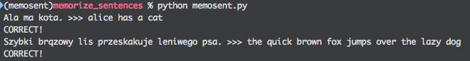

MemoSent
========

> Memorize whole sentences instead of words.

It uses Google Spreadsheets for storing testing data.




NOTE: it's in a proof of concept stage, wrapping over Google's quick start functions.

## Installation

### Set up virtualenv

```
mkvirtualenv memosent --python=python3.6
pip install --upgrade google-api-python-client
```

### API key

1) Create your own API key as specified here:
https://developers.google.com/sheets/api/quickstart/python

2) Save the key file as `./client_secret.json`


## Usage example

```bash
% python memosent.py
Ala ma kota. >>> alice has a cat
CORRECT!
Szybki brązowy lis przeskakuje leniwego psa. >>> the lazy fox lays next to the lazy dog
Incorrect. It should be: The quick brown fox jumps over the lazy dog.
```
